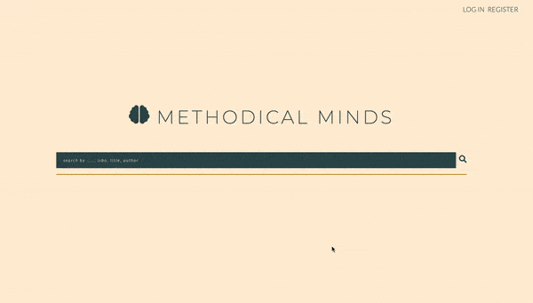

# methodical-minds

A full-stack web application, modeled from Harvard's CS50 course "Web Programming with Python and JavaScript".

A full-stack web application that allows logged in and verified users to search for books also to view, add, and store reviews. (HTML,CSS, JS, PYTHON, FLASK, PostgreSql)

Essentially I followed the syllabus' guidelines as to what the application should consist of:

-Authentication
  -ability to log in, register, and log out
-Import a '.csv' file into your database (PostgreSQL), via an 'import.py' file.
-Search filter that allows the user to search using either the ISBN, author, or title of the book.
  -returns data based on the query made
-Add Reviews
-With the psql database, users can add reviews that are then stored in the database, also available to view on the book page.
-View GoodReads ratings and number of reviews per book using the GoodReads API

Here is a preview of the application, as well as a link listed above to demo!
  
  
